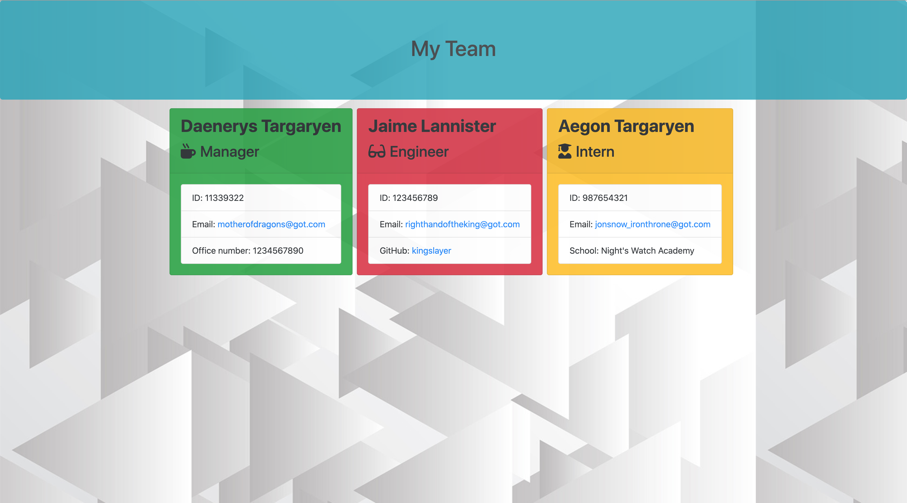
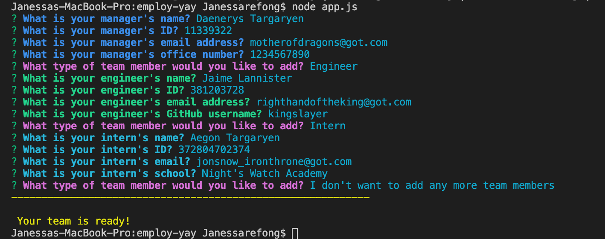

# Employ-YAY! 

In this project, I’ve created an application that takes information about employees and generates an HTML page that would display the summary of each employee. This is generated using the command line application that will prompt the user a series of questions for information about the team manager and the team members. With this application, there is only one team manager but the user can have as many team members composed of engineers and interns. This is made for managers that would like to display and easily access the information of each of their employees' emails and profiles. The ID numbers of each employee and the manager's office number specifically need to be valid numbers with no other characters involved. The user should know that if the user already created a team before and would like to add more members, this application will overwrite any previously saved team.html files. Fair warning to be sure about the changes any user would like to make.

In this project, it has passed all the unit tests and utilizes Inquirer npm package to prompt the user the following information: Name, Email, ID and specific information based on their role in the company. This also uses Jest to run the tests in the application as well as the colorful questions with the Chalk npm package. All the dependencies are found in the package.json file.

I'm still learning on how to use regular expressions so validating the email and the rest of the questions posed a challenge for me and I was only able to get the numbers validated but soon enough, I hope to incorporate this. I did enjoy using the Chalk library to create the colorful questions and I did enjoy doing my demo with references to Game of Thrones (warning for spoilers!). I added my own styling to this project with backgrounds and color coding. In the demo provided below at the [Usage](#usage), you will notice that the team profile generator was at its default styling and if you look at the section, [Images of Project](#images-of-project), I have updated the look of my application.


## Table of Contents

* [Technologies Used](#technologies-used)
* [Installing](#installing)
* [Usage](#usage)
* [GIF of Project](#gif-of-project)
* [Image of Project](#image-of-project)
* [Code Snippet](#code-snippet)
* [Authors](#authors)
* [License](#license)
* [Acknowledgments](#acknowledgments)

## Technologies Used

* [HTML](https://developer.mozilla.org/en-US/docs/Web/HTML)
* [Node.js](https://nodejs.org/en/)
* [Javascript](https://developer.mozilla.org/en-US/docs/Web/JavaScript)
* [Inquirer](https://www.npmjs.com/package/inquirer)
* [Jest](https://www.npmjs.com/package/jest)
* [Chalk](https://www.npmjs.com/package/chalk)

## Installing
  
  Step-by-step guide on how to install this Employee Team Generator:
  - start by cloning down this respository by clicking on the green button "code" on the top right corner of the main content and copying/saving to clipboard the https url.
  - in your command line, choose a folder destination on your computer and write the command "git clone [paste url link]" 
  - open the folder in VS Code
  - open your command line in your VS Code or the command line application you have installed on your device (be sure you're at the right folder containing the content and you can check this by using the command "ls" and/or "pwd")
  - use the command "npm install" (this downloads the dependencies available inside the package.json file)
    - you should see a node_modules folder
  - once installations are done, you can run the command "node app.js" to begin the questions
  - if you would like to run tests in this application, you can run the command "npm run test"

  ## Usage

  To see how this Employee Team Generator works using node, see the demo available at the link below (view-only):
  
  https://drive.google.com/drive/folders/1zjzaJTe6mG849HXwoCz7C-8TlOA9cP_i?usp=sharing

## GIF of Project


## Images of Project

Attached below is a picture of the application and the employee questions using the Chalk and Inquirer libraries.




## Code Snippet

  In this code snippet, this function is where the user can decide whether to add new team members or not and grabbing the user's choice, if the user chooses either "Engineer" or "Intern" then those functions will run and it will prompt the user a few questions to grab information for each member and after the user inputs each employee's information, the user will be prompted with this list again unless the user decides to not add any more members. If the user decides not to add any more team members, the application will stop running, the user's inputs will be rendered and be written into "team.html". You can also see how I used the chalk library here to give the colors to the text.

```
 // function being called to prompt user if they want additional members in the team such as engineers and interns. If not, the prompts will stop and it will render and write the information into a file in the output directory named team.html
function newEmployee() {
    inquirer.prompt([{
        type: "list",
        name: "teammember",
        message: chalk.magenta("What type of team member would you like to add?"),
        choices: ["Engineer", "Intern", "I don't want to add any more team members"],
    }, ]).then(function(data) {
        if (data.teammember === "Engineer") {
            engineerEmployee();
        } else if (data.teammember === "Intern") {
            internEmployee();
        } else {
            const finalOutput = render(teamArray);
            fs.writeFile("output/team.html", finalOutput,
                function(err) {
                    if (err) throw err;

                    console.log(chalk.yellow("-".repeat(60) + "\n\n Your team is ready!"));
                });
        };
    });
};
```

## Authors

* Janessa Reeanne Fong

- [Link to Github](https://github.com/janessaref)
- [Link to LinkedIn](https://www.linkedin.com/in/janessafong)

## License

This project is licensed under the MIT License 

## Acknowledgments

* I'd like to acknowledge Andrew Knapp, my tutor who has helped me understand constructors and testing better.
* I'd like to also acknowledge my instructors and TAs, Roger Lee, Kerwin Hy and Manuel Nunes that helped me towards accomplishing this project.
* I'd like to acknowledge Rufio and his blog post that has helped me with validating numbers using the Inquirer library here : https://iamrufio.com/blog/2019/09/node-cli-inquirer/

